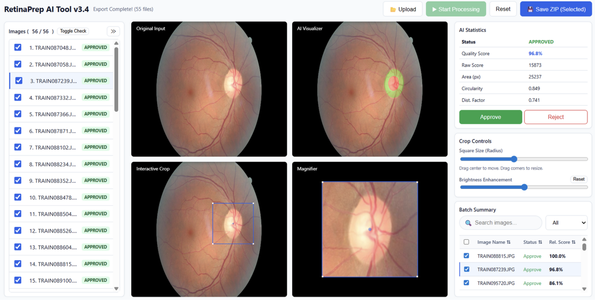

# RetinaPrep: Human-in-the-Loop Fundus Pre-processing

**RetinaPrep** is a web-based, "Human-in-the-Loop" tool designed to standardize the cropping and quality assurance of retinal fundus images for deep learning applications. It bridges the gap between fully automated scripts and manual curation by providing an interactive interface to verify, correct, and export high-quality datasets.

  
*Figure 1: The Main Interface showing the Tri-Pane view (Original, AI Mask, Interactive Crop).*

## Key Features

1. **Intelligent Discovery:** "Gallery Grid" view with color-coded status badges (Approved/Rejected) based on AI confidence scores.
2. **Tri-Pane Editing:** Synchronized view of the **Original Input**, **AI Segmentation Mask** (SegFormer), and **Interactive Crop**.
3. **Precision Tools:**
    - a) **Click-to-Center:** Manually correct optic disc alignment with a single click.
    - b) **Dynamic Resizing:** Adjust crop radius pixel-perfectly using drag handles.
    - c) **Visual Enhancement:** Hardware-accelerated brightness slider for inspecting dark fundus images without altering the export.
4. **Quality Assurance:** Real-time metrics for Quality Score, Circularity, and Geometric Area.
5. **Structured Output:**
    - a) Auto-generated CSV reports (containing filenames, geometric metrics, and validation status).
    - b) Standardized ZIP archives containing separated `Crops/` (for training) and `Visualizations/` (for debugging) folders.

## 🛠️ Tech Stack

- **Backend:** Python 3.x, Flask
- **Frontend:** HTML5, JavaScript, Bootstrap
- **AI Model:** SegFormer (HuggingFace Transformers)
- **Image Processing:** OpenCV, Pillow (PIL)

---

## 💻 Installation & Setup

Follow these steps to run RetinaPrep locally.

1. **Clone the Repository**
   ```bash
   git clone https://github.com/OmarSulaivany/RetinaPrep.git
   cd RetinaPrep
   ```

2. **Create a Virtual Environment (Recommended)**  
   It is best practice to run this in an isolated environment to avoid dependency conflicts.

   **Windows:**
   ```bash
   python -m venv venv
   venv\Scripts\activate
   ```

   **Mac/Linux:**
   ```bash
   python3 -m venv venv
   source venv/bin/activate
   ```

3. **Install Dependencies**
   ```bash
   pip install -r requirements.txt
   ```
   **Note:** This will install Flask, PyTorch, Transformers, OpenCV, and other required libraries.

4. **Model Setup**  
   Ensure the segmentation model weights are present. If you are using a custom trained SegFormer model, place the `.pth` file in the `models/` directory and update the config path in `app.py`.

---

## ▶️ Usage

1. **Start the Server**  
   Run the Flask application from your terminal:
   ```bash
   python app.py
   ```
   You should see a message indicating the server is running on `http://127.0.0.1:5000`.

2. **Open the Interface**  
   Open your web browser (Chrome/Firefox recommended) and navigate to:  
   `http://localhost:5000`

---

## 🔁 The Workflow

1. **Upload:** Drag and drop a folder of fundus images (JPG/PNG) into the dashboard.
2. **Discovery:** The system will generate a "Heat Map" gallery.
   - **Green Badges:** High confidence (Auto-Approved).
   - **Red Badges:** Low confidence (flagged for review).
3. **Verify & Edit:** Click any image to enter the Tri-Pane view.
   - **Move:** Drag the blue box to correct the center.
   - **Resize:** Drag the corners to adjust the radius.
   - **Enhance:** Use the Brightness Slider to see details in dark images.
4. **Export:** Click **"Save ZIP"**. The tool will download a ZIP file containing your validated crops and a CSV summary report.

---

## 📂 Project Structure

```plaintext
RetinaPrep/
├── templates/
│   └── index.html      # Main HTML interface
├── app.py              # Main Flask application entry point
├── requirements.txt    # Python dependencies
└── README.md           # Documentation
```

---

## 📄 Citation

If you use this tool in your research, please link to this repository:

```bibtex
@software{retinaprep2026,
  author = {Omar Sulaivany},
  title = {RetinaPrep: Optic Disc-Centered Pre-processing for Fundus Images},
  url = {https://github.com/OmarSulaivany/RetinaPrep},
  year = {2026}
}
```

---

## 🤝 Acknowledgements

The authors express their gratitude to Professor Rui Rodrigues of the Department of Informatics Engineering at the Faculty of Engineering, University of Porto (FEUP). His valuable insights and guidance regarding the visualization strategies and interactive interface design significantly contributed to the refinement of the RetinaPrep tool.
